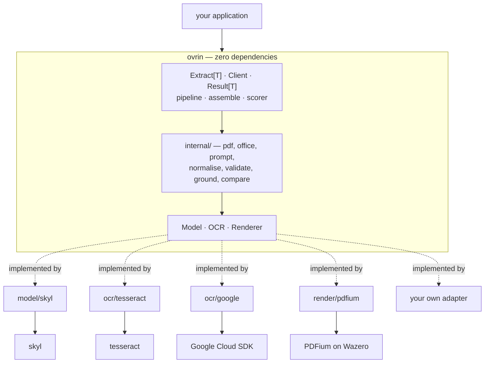
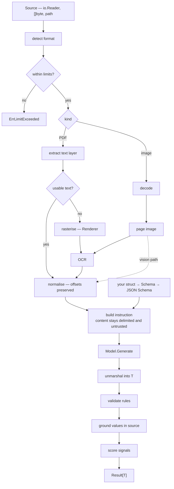

# Architecture

Ovrin turns a document into a typed Go value. This document describes how the
pieces fit and, more importantly, which way the dependency arrows point.

**Contents:** [Layout](#layout) · [The seams](#the-seams) ·
[Why the client is not the interface](#why-the-client-is-not-the-interface) ·
[The data model](#the-data-model) · [Flow](#flow) · [Errors](#errors) ·
[Concurrency](#concurrency) · [Testing strategy](#testing-strategy) ·
[See also](#see-also)

---

## Layout

```text
ovrin/                        module github.com/BAGOMBEKA-JOB-DEV/ovrin
│                             zero external dependencies, no cgo
├── doc.go                    the package overview
├── ovrin.go                  Client, Option, New, Extract[T]
├── result.go                 Result[T], FieldResult, Candidate, Explanation
├── source.go                 Source, Document, Kind, format detection
├── model.go                  the Model seam            ── ADR-0007
├── ocr.go                    the OCR seam              ── ADR-0009
├── render.go                 the Renderer seam         ── ADR-0010
├── chain.go                  OCRChain, ModelChain      ── ADR-0018
├── breaker.go                BreakOCR, BreakModel      ── ADR-0018
├── batch.go                  ExtractBatch
├── layout.go                 Layout, Table, KeyValue across the OCR seam
├── pipeline.go               stage orchestration       ── ADR-0002
├── assemble.go               the schema walk: validate, ground, score, write
├── scorer.go                 the default Scorer and its weights
├── confidence.go             Signal, Scorer            ── ADR-0013
├── crossfield.go             CrossFieldRule            ── ADR-0014
├── provenance.go             Provenance, Rect, Span    ── ADR-0015
├── limits.go                 the limit options         ── ADR-0020
├── hook.go                   Hook, Event               ── ADR-0021
├── errors.go                 sentinels and *Error      ── ADR-0019
├── example_test.go
│
├── internal/
│   ├── detect/               format detection, limits before allocation
│   ├── pdf/                  text-layer extraction     ── ADR-0011
│   ├── office/               DOCX, XLSX and CSV text
│   ├── img/                  image decoding, normalisation
│   ├── prompt/               instruction construction  ── ADR-0017
│   ├── retry/                the one schema-invalid follow-up request
│   ├── normalise/            offset-preserving text normalisation
│   ├── schema/               struct-tag reflection     ── ADR-0005
│   ├── jsonschema/           Schema to JSON Schema
│   ├── validate/             rule evaluation
│   ├── ground/               value-to-source matching
│   ├── compare/              two readings, one verdict ── ADR-0014
│   ├── adaptertest/          the shared contract suite ── ADR-0022
│   └── sandbox/              offline provider server
│
├── model/skyl/               own go.mod                ── ADR-0008
├── ocr/tesseract/            own go.mod
├── ocr/google/               own go.mod
├── ocr/textract/             own go.mod — AWS Textract
├── ocr/azure/                own go.mod
├── render/pdfium/            own go.mod, Wazero        ── ADR-0010
├── otel/                     own go.mod                ── ADR-0021
│
├── eval/                     corpus and harness        ── ADR-0023
├── examples/receipt/         own go.mod — a runnable end-to-end example
└── docs/
```

The tree shows where files sit. What matters more is which way the dependency
arrows point.



Every arrow into the core is dotted, and every dotted arrow crosses a module
boundary. That is the whole design: the core defines interfaces and never
imports an implementation, so a user's `go.sum` contains exactly the providers
they chose and nothing else ([ADR-0009](adr/0009-ocr-seam.md), rule
[§4.2](rules.md#4-dependencies)).

**Inside the module the arrows point one way only: root → `internal/`.** No
package under `internal/` imports the root, because the root imports them and
Go rejects a cycle. So an internal package that needs to hand back something
shaped like a public type declares its own — `prompt.Request` mirrors
`ModelRequest` field for field — and the root converts at the boundary. The
conversion is mechanical and deliberately boring; that boringness is the price
of the public types being owned by exactly one package.

It is also why `pipeline.go` sits in the root rather than under `internal/`.
The orchestration touches nearly the whole public type set, so an internal
package would have needed a local twin of `Model`, `OCR`, `Page`, `Content`,
`FieldResult`, `Signal`, `Provenance`, `Metadata` and `Event`, converted at
every stage boundary — a great deal of mechanical code bought for a boundary
that unexported identifiers already give. `assemble.go`, `scorer.go` and
`crossfield.go` are in the root for the same reason.

---

## The seams

Three interfaces, all declared in the core, all implemented elsewhere.

```go mirror
// Model produces structured JSON from document content.        ADR-0007
type Model interface {
    Generate(ctx context.Context, req ModelRequest) (*ModelResponse, error)
}

// OCR recovers text and layout from a rasterised page.          ADR-0009
type OCR interface {
    Recognise(ctx context.Context, page Page) (*Recognition, error)
    Name() string
}

// Renderer rasterises a document page to an image.              ADR-0010
type Renderer interface {
    Render(ctx context.Context, doc Document, page, dpi int) (image.Image, error)
}
```

All three are small on purpose. An adapter should be implementable in an
afternoon and have one obvious correct form. Everything that could be decided
in more than one way — retry, fallback, limits, prompt construction, scoring —
is on the core's side of the seam, so it is decided once
(rule [§6.2](rules.md#6-adapters)).

Only `Model` is required. A client with no `OCR` handles text-layer PDFs and
nothing else; a client with no `Renderer` handles anything that is already an
image, plus cloud OCR providers that accept a PDF directly.

---

## The client

```go mirror
// Client holds the providers, limits and policy an extraction runs under.
// It is built once and shared; every method is safe for concurrent use.
type Client struct {
	cfg   config
	cache schema.Cache
}

// Option configures a Client, or one Extract call. See ADR-0026.
type Option interface {
	apply(*config)
}

func New(opts ...Option) *Client
```

`New` panics if given `WithModel(nil)` — a nil provider is programmer error at
construction, and the alternative is a nil dereference on the first extraction,
thousands of lines from the mistake (rule [§1.6](rules.md#1-public-api)).
Omitting `WithModel` entirely is *configuration*, not a programmer error, and
surfaces as `ErrNoProvider` from `Extract`.

`Option` is an interface with one unexported method over an unexported
`config`. That is what lets the same type apply both to `New` and to a single
`Extract` call without exporting a config struct (rule
[§1.4](rules.md#1-public-api)), and the unexported method keeps the set of
options closed. A bare `func(*config)` would have worked too, but godoc renders
it literally — naming a type the reader cannot see.

---

## Why the client is not the interface

`New` returns `*Client`, a struct, not an interface
(rule [§1.3](rules.md#1-public-api)).

The instinct to return an interface comes from wanting to substitute ovrin in a
caller's tests. That substitution belongs at the caller's own boundary, not
ours. If ovrin exported an interface, it would have to contain `Extract`, which
is generic and package-level ([ADR-0003](adr/0003-go-floor-and-generics.md)) —
so the interface could not contain the one method anyone wants.

Callers who need a test double define a one-method interface in their own
package describing what they use. That is the Go idiom, and it means adding a
method to `*Client` never breaks anyone.

---

## The data model

```go mirror
type Result[T any] struct {
    Data        T                        // typed, partially populated  ADR-0004
    Valid       bool                     // every rule passed
    Confidence  float64                  // aggregate                   ADR-0013
    Fields      map[string]FieldResult   // one per schema field
    NeedsReview bool
    Reasons     []ReviewReason
    Metadata    Metadata                 // readings, providers, usage, timings
}

type FieldResult struct {
    Value      any
    Found      bool          // false means absent, never zero          ADR-0004
    Confidence float64
    Valid      bool
    Signals    []Signal      // what produced the confidence            ADR-0013
    Provenance []Provenance  // where it came from                      ADR-0015
    Candidates []Candidate   // competing readings, if any              ADR-0014
    Validation []RuleResult  // each rule, and whether it passed
    Errors     []error
}
```

Four properties of this shape are load-bearing:

**`Data` is typed.** `res.Data.Total` is a `float64` known at compile time.
That is the reason to do this in Go rather than call a service.

**`Found` is not `Value != zero`.** A field that could not be read is absent
and says so. Nothing is ever guessed to satisfy a struct
(rule [§8.5](rules.md#8-confidence-and-provenance)).

**Every number decomposes.** `Confidence` is derived from `Signals`, each of
which has a name, a weight and a one-line note.

**Every value points back at the document.** `Provenance` carries the reading,
page, box and span, which is what makes review and audit possible.

### The supporting types

Everything `Result[T]` and the seams refer to. Declared here so that no type in
this project is used without a definition somewhere.

```go mirror
// Op names a pipeline stage. It appears on both Error and Event so that a
// trace and an error use the same word. See ADR-0027.
type Op string

const (
    OpUnknown   Op = ""
    OpDetect    Op = "detect"
    OpAcquire   Op = "acquire"
    OpRender    Op = "render"     // within acquire
    OpOCR       Op = "ocr"        // within acquire
    OpNormalise Op = "normalise"
    OpSchema    Op = "schema"
    OpPrompt    Op = "prompt"
    OpGenerate  Op = "generate"
    OpValidate  Op = "validate"
    OpGround    Op = "ground"
    OpScore     Op = "score"
)

// Reading is how a value was read. It describes the past. See ADR-0028.
type Reading string

const (
    ReadingUnknown Reading = ""
    ReadingText    Reading = "text"
    ReadingOCR     Reading = "ocr"
    ReadingVision  Reading = "vision"
)

// ReadingMode selects how a document should be read. It describes an
// intention, and is the argument to WithReading. See ADR-0028.
type ReadingMode string

const (
    ReadingAuto ReadingMode = "auto"   // staged, per ADR-0012. The default.
    ModeText    ReadingMode = "text"
    ModeOCR     ReadingMode = "ocr"
    ModeVision  ReadingMode = "vision"
    ModeBoth    ReadingMode = "both"   // two readings, per ADR-0014
)

// Kind is a document format, determined by content and never by filename.
type Kind string

const (
    KindUnknown Kind = ""
    KindPDF     Kind = "pdf"
    KindPNG     Kind = "png"
    KindJPEG    Kind = "jpeg"
    KindTIFF    Kind = "tiff"
    KindWebP    Kind = "webp"
    KindDOCX    Kind = "docx"
    KindXLSX    Kind = "xlsx"
    KindCSV     Kind = "csv"
)

// DateOrder resolves ambiguous numeric dates such as 03/04/2026. The zero
// value flags them for review rather than guessing.
type DateOrder string

const (
    DateOrderUnknown DateOrder = ""
    DayFirst         DateOrder = "dmy"
    MonthFirst       DateOrder = "mdy"
    YearFirst        DateOrder = "ymd"
)

// Document is a Source whose format has been identified. Data is the document
// itself: a Renderer and a DocumentOCR are asked to read it, so they must be
// able to reach it.
type Document struct {
    Kind  Kind
    Pages int
    Size  int64
    Data  []byte
}

// Page is one rasterised page, handed to an OCR provider.
type Page struct {
    Number int          // 1-based
    Image  image.Image
    Width  float64      // page points
    Height float64      // page points
    DPI    int
}

// Rect is a region of a page, in points, origin top-left. That origin is
// neither PDF's nor an image format's; one had to be chosen, and adapters
// normalise to it.
type Rect struct{ MinX, MinY, MaxX, MaxY float64 }

// Span is a byte range into the normalised text. Bytes, not runes: Go strings
// are bytes, and converting would cost a copy at every boundary.
type Span struct{ Start, End int }

// Line is a run of words sharing a baseline.
type Line struct {
    Text string
    Box  Rect
    Page int
}

// Content is one piece of material handed to a Model. It is always untrusted.
type Content struct {
    Reading   Reading
    Page      int
    Text      string   // set when Reading is text or ocr
    Image     []byte   // set when Reading is vision; raw, never base64
    MediaType string   // required when Image is set
}

// Usage counts what an extraction consumed. Page units are what OCR providers
// bill; tokens are what models bill.
type Usage struct {
    InputTokens  int
    OutputTokens int
    PageUnits    int
}

// Metadata records how a result was produced.
type Metadata struct {
    Readings  []Reading
    Providers map[Op]string     // which adapter served each stage
    Kind      Kind
    Pages     int
    Usage     Usage
    Retried   bool              // the model was asked twice; its first reply was malformed
    Duration  time.Duration
}

// ReviewReason names a field and why it needs a person. It never carries the
// value: rule §7.5.
type ReviewReason struct {
    Field string
    Why   string
}

// RuleResult is one validation rule and its outcome. Message rather than error,
// so an Explanation marshals to JSON.
type RuleResult struct {
    Rule    string   // "required", "min=0", "format=date"
    Passed  bool
    Message string
}

// FieldEvidence is everything the pipeline collected about one field. It is
// the input to a Scorer.
type FieldEvidence struct {
    Field      string
    Value      any
    Found      bool
    Reading    Reading
    OCRConfidence *float64   // nil when the value did not come from OCR
    Grounding  float64
    Ambiguous  bool          // a declared format parsed, but two ways
    Provenance []Provenance
    Candidates []Candidate
    Agreement  *float64      // nil when only one reading ran
    AgreementNote string
    Validation []RuleResult
    Suspicious bool
}
```

### Sources

`Extract` takes a `Source`, not a file. Three constructors cover the ways a
document arrives:

```go mirror
// Source is an unread document. The interface is closed — it has an
// unexported method — so the only Sources are the three below. An open
// interface would let a caller supply something no stage knows how to read.
type Source interface {
    isSource()
}

func Reader(r io.Reader) Source   // an upload, a network body, a pipe
func Bytes(b []byte) Source       // already in memory
func File(path string) Source     // on disk
```

`Reader` is the primary one, because a document usually arrives as a stream and
buffering it before ovrin can check its size limit would defeat the limit
([ADR-0020](adr/0020-resource-limits.md)). Format is determined by content, not
by filename or a caller-supplied media type — a `.pdf` that is actually a JPEG
is common enough that trusting the name is how a parser gets handed input it
was not written for.

---

## Flow



Two things to note. **Content acquisition is staged, not chosen up front**
([ADR-0012](adr/0012-text-first-ocr-on-demand.md)) — the text layer is tried
first because when it works it is exact and nearly free. And **the schema
enters at the prompt, never through the document** — an injected instruction
cannot change the output shape, because the shape was fixed before the document
was read ([ADR-0017](adr/0017-untrusted-document-content.md)).

When two readings are requested, the right-hand side of the graph runs twice
and the results are compared field by field
([ADR-0014](adr/0014-cross-validation.md)).

---

## Errors

Sentinels for the kind, one typed `*Error` for the detail, and a multi-error
`Unwrap` so both questions can be asked of the same value
([ADR-0019](adr/0019-error-model.md), [ADR-0030](adr/0030-an-internal-failure-sentinel.md)).

This is the **current, complete** set. ADR-0019's own listing is the historical
record of the twelve decided then; this one is checked against the code on
every test run.

```go mirror
var (
	ErrUnsupportedFormat = errors.New("ovrin: unsupported document format")
	ErrNoContent         = errors.New("ovrin: no readable content in document")
	ErrNoProvider        = errors.New("ovrin: no provider configured for this document")
	ErrSchema            = errors.New("ovrin: invalid schema")
	ErrLimitExceeded     = errors.New("ovrin: resource limit exceeded")
	ErrAuth              = errors.New("ovrin: provider authentication failed")
	ErrRateLimit         = errors.New("ovrin: provider rate limited")
	ErrUnavailable       = errors.New("ovrin: provider unavailable")
	ErrBadResponse       = errors.New("ovrin: provider returned an unusable response")
	ErrUnsupported       = errors.New("ovrin: unsupported by this provider")
	ErrEncrypted         = errors.New("ovrin: document is encrypted")
	ErrInternal          = errors.New("ovrin: internal failure")
	ErrBadRequest        = errors.New("ovrin: provider rejected the request")
)
```

Which one you get decides what to do about it, and they are deliberately
different questions: fix the document, fix the schema, raise a limit, fix a
credential, change provider — or, for `ErrInternal` alone, file a bug against
ovrin.


```go
res, err := ovrin.Extract[Invoice](ctx, c, src)

switch {
case errors.Is(err, ovrin.ErrRateLimit):     // back off
case errors.Is(err, ovrin.ErrAuth):          // alert; do not retry
case errors.Is(err, context.DeadlineExceeded): // same err value, other question
}
```

A returned error means the extraction as a whole was meaningless. A field that
could not be read is not an error — it is a `FieldResult` with `Found` false
(rule [§2.6](rules.md#2-errors)).

Errors never carry document content
(rule [§2.5](rules.md#2-errors)). They carry the operation, the page, the
field and the provider.

---

## Concurrency

A `*Client` is built once and shared. Everything exported is safe for
concurrent use (rule [§5.1](rules.md#5-concurrency-and-resources)).

Within one extraction, page-level work — rasterising, OCR, per-page text
extraction — runs concurrently up to `WithConcurrency`, defaulting to
`min(4, GOMAXPROCS)` so ovrin does not monopolise a host it shares. Model calls
are not parallelised across pages, because extraction needs the whole document.

Cancellation propagates to every stage and every provider call, and every test
that starts a goroutine asserts it stopped
(rules [§5.4](rules.md#5-concurrency-and-resources),
[§3.6](rules.md#3-testing)).

There is no global state — no registry, no default client, no `init` side
effects. Two clients in one process cannot observe each other
(rule [§5.5](rules.md#5-concurrency-and-resources)).

---

## Testing strategy

Three tiers ([ADR-0022](adr/0022-offline-testing.md)):

```bash
make test              # in-process. fast, free, offline
make test-sandbox      # full stack over real sockets, no credentials
make test-integration  # real providers, real money
make eval              # accuracy against the corpus  ADR-0023
```

Correctness is a unit test. **Accuracy is not** — it is a distribution measured
by the evaluation harness, and no accuracy claim is made that the harness
cannot reproduce (rule [§3.8](rules.md#3-testing)).

---

## See also

- [`pipeline.md`](pipeline.md) — each stage in detail
- [`schema.md`](schema.md) — the tag grammar and rule vocabulary
- [`confidence.md`](confidence.md) — signals, weights and comparison
- [`threat-model.md`](threat-model.md) — what ovrin defends against, and what it does not
- [`providers.md`](providers.md) — writing an adapter
- [`rules.md`](rules.md) — the engineering rules everything above cites
- [`adr/`](adr/) — why it is like this
