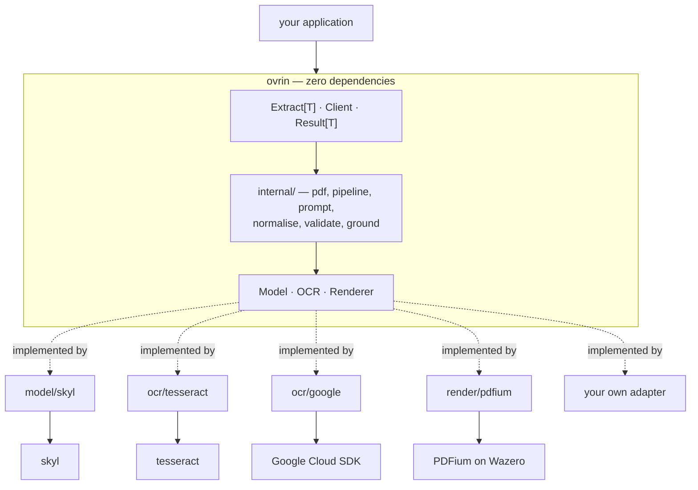
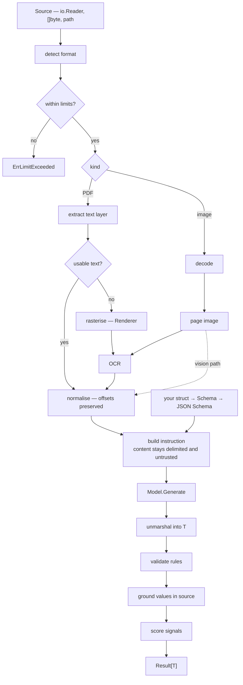

# Architecture

Ovrin turns a document into a typed Go value. This document describes how the
pieces fit and, more importantly, which way the dependency arrows point.

**Contents:** [Layout](#layout) · [The seams](#the-seams) ·
[Why the client is not the interface](#why-the-client-is-not-the-interface) ·
[The data model](#the-data-model) · [Flow](#flow) · [Errors](#errors) ·
[Concurrency](#concurrency) · [Testing strategy](#testing-strategy) ·
[See also](#see-also)

---

## Layout

```text
ovrin/                        module github.com/BAGOMBEKA-JOB-DEV/ovrin
│                             zero external dependencies, no cgo
├── ovrin.go                  Client, Option, New, Extract[T]
├── result.go                 Result[T], FieldResult, Candidate, Explanation
├── source.go                 Source, Document, Kind, format detection
├── schema.go                 struct-tag reflection into an internal Schema
├── model.go                  the Model seam            ── ADR-0007
├── ocr.go                    the OCR seam              ── ADR-0009
├── render.go                 the Renderer seam         ── ADR-0010
├── chain.go                  OCRChain, ModelChain      ── ADR-0018
├── confidence.go             Signal, Scorer            ── ADR-0013
├── provenance.go             Provenance, Rect, Span    ── ADR-0015
├── limits.go                 the limit options         ── ADR-0020
├── hook.go                   Hook, Event               ── ADR-0021
├── errors.go                 sentinels and *Error      ── ADR-0019
├── example_test.go
│
├── internal/
│   ├── pdf/                  text-layer extraction     ── ADR-0011
│   ├── img/                  image decoding, normalisation
│   ├── pipeline/             stage orchestration
│   ├── prompt/               instruction construction  ── ADR-0017
│   ├── normalise/            offset-preserving text normalisation
│   ├── jsonschema/           Schema to JSON Schema
│   ├── validate/             rule evaluation
│   ├── ground/               value-to-source matching
│   ├── adaptertest/          the shared contract suite ── ADR-0022
│   ├── sandbox/              offline provider server
│   └── testutil/
│
├── model/skyl/               own go.mod                ── ADR-0008
├── ocr/tesseract/            own go.mod
├── ocr/google/               own go.mod
├── ocr/aws/                  own go.mod
├── render/pdfium/            own go.mod, Wazero        ── ADR-0010
├── otel/                     own go.mod                ── ADR-0021
│
├── eval/                     corpus and harness        ── ADR-0023
└── docs/
```

The tree shows where files sit. What matters more is which way the dependency
arrows point.



Every arrow into the core is dotted, and every dotted arrow crosses a module
boundary. That is the whole design: the core defines interfaces and never
imports an implementation, so a user's `go.sum` contains exactly the providers
they chose and nothing else ([ADR-0009](adr/0009-ocr-seam.md), rule
[§4.2](rules.md#4-dependencies)).

---

## The seams

Three interfaces, all declared in the core, all implemented elsewhere.

```go
// Model produces structured JSON from document content.        ADR-0007
type Model interface {
    Generate(ctx context.Context, req ModelRequest) (*ModelResponse, error)
}

// OCR recovers text and layout from a rasterised page.          ADR-0009
type OCR interface {
    Recognise(ctx context.Context, page Page) (*Recognition, error)
    Name() string
}

// Renderer rasterises a document page to an image.              ADR-0010
type Renderer interface {
    Render(ctx context.Context, doc Document, page, dpi int) (image.Image, error)
}
```

All three are small on purpose. An adapter should be implementable in an
afternoon and have one obvious correct form. Everything that could be decided
in more than one way — retry, fallback, limits, prompt construction, scoring —
is on the core's side of the seam, so it is decided once
(rule [§6.2](rules.md#6-adapters)).

Only `Model` is required. A client with no `OCR` handles text-layer PDFs and
nothing else; a client with no `Renderer` handles anything that is already an
image, plus cloud OCR providers that accept a PDF directly.

---

## Why the client is not the interface

`New` returns `*Client`, a struct, not an interface
(rule [§1.3](rules.md#1-public-api)).

The instinct to return an interface comes from wanting to substitute ovrin in a
caller's tests. That substitution belongs at the caller's own boundary, not
ours. If ovrin exported an interface, it would have to contain `Extract`, which
is generic and package-level ([ADR-0003](adr/0003-go-floor-and-generics.md)) —
so the interface could not contain the one method anyone wants.

Callers who need a test double define a one-method interface in their own
package describing what they use. That is the Go idiom, and it means adding a
method to `*Client` never breaks anyone.

---

## The data model

```go
type Result[T any] struct {
    Data        T                        // typed, partially populated  ADR-0004
    Valid       bool                     // every rule passed
    Confidence  float64                  // aggregate                   ADR-0013
    Fields      map[string]FieldResult   // one per schema field
    NeedsReview bool
    Reasons     []ReviewReason
    Metadata    Metadata                 // readings, providers, usage, timings
}

type FieldResult struct {
    Value      any
    Found      bool          // false means absent, never zero          ADR-0004
    Confidence float64
    Valid      bool
    Signals    []Signal      // what produced the confidence            ADR-0013
    Provenance []Provenance  // where it came from                      ADR-0015
    Candidates []Candidate   // competing readings, if any              ADR-0014
    Errors     []error
}
```

Four properties of this shape are load-bearing:

**`Data` is typed.** `res.Data.Total` is a `float64` known at compile time.
That is the reason to do this in Go rather than call a service.

**`Found` is not `Value != zero`.** A field that could not be read is absent
and says so. Nothing is ever guessed to satisfy a struct
(rule [§8.5](rules.md#8-confidence-and-provenance)).

**Every number decomposes.** `Confidence` is derived from `Signals`, each of
which has a name, a weight and a one-line note.

**Every value points back at the document.** `Provenance` carries the reading,
page, box and span, which is what makes review and audit possible.

---

## Flow



Two things to note. **Content acquisition is staged, not chosen up front**
([ADR-0012](adr/0012-text-first-ocr-on-demand.md)) — the text layer is tried
first because when it works it is exact and nearly free. And **the schema
enters at the prompt, never through the document** — an injected instruction
cannot change the output shape, because the shape was fixed before the document
was read ([ADR-0017](adr/0017-untrusted-document-content.md)).

When two readings are requested, the right-hand side of the graph runs twice
and the results are compared field by field
([ADR-0014](adr/0014-cross-validation.md)).

---

## Errors

Sentinels for the kind, one typed `*Error` for the detail, and a multi-error
`Unwrap` so both questions can be asked of the same value
([ADR-0019](adr/0019-error-model.md)):

```go
res, err := ovrin.Extract[Invoice](ctx, c, src)

switch {
case errors.Is(err, ovrin.ErrRateLimit):     // back off
case errors.Is(err, ovrin.ErrAuth):          // alert; do not retry
case errors.Is(err, context.DeadlineExceeded): // same err value, other question
}
```

A returned error means the extraction as a whole was meaningless. A field that
could not be read is not an error — it is a `FieldResult` with `Found` false
(rule [§2.6](rules.md#2-errors)).

Errors never carry document content
(rule [§2.5](rules.md#2-errors)). They carry the operation, the page, the
field and the provider.

---

## Concurrency

A `*Client` is built once and shared. Everything exported is safe for
concurrent use (rule [§5.1](rules.md#5-concurrency-and-resources)).

Within one extraction, page-level work — rasterising, OCR, per-page text
extraction — runs concurrently up to `WithConcurrency`, defaulting to
`min(4, GOMAXPROCS)` so ovrin does not monopolise a host it shares. Model calls
are not parallelised across pages, because extraction needs the whole document.

Cancellation propagates to every stage and every provider call, and every test
that starts a goroutine asserts it stopped
(rules [§5.4](rules.md#5-concurrency-and-resources),
[§3.6](rules.md#3-testing)).

There is no global state — no registry, no default client, no `init` side
effects. Two clients in one process cannot observe each other
(rule [§5.5](rules.md#5-concurrency-and-resources)).

---

## Testing strategy

Three tiers ([ADR-0022](adr/0022-offline-testing.md)):

```bash
go test ./...                    # in-process. fast, free, offline
go test -tags=sandbox ./...      # full stack over real sockets, no credentials
go test -tags=integration ./...  # real providers, real money
go test -tags=eval ./eval/...    # accuracy against the corpus  ADR-0023
```

Correctness is a unit test. **Accuracy is not** — it is a distribution measured
by the evaluation harness, and no accuracy claim is made that the harness
cannot reproduce (rule [§3.8](rules.md#3-testing)).

---

## See also

- [`pipeline.md`](pipeline.md) — each stage in detail
- [`schema.md`](schema.md) — the tag grammar and rule vocabulary
- [`confidence.md`](confidence.md) — signals, weights and comparison
- [`threat-model.md`](threat-model.md) — what ovrin defends against, and what it does not
- [`providers.md`](providers.md) — writing an adapter
- [`rules.md`](rules.md) — the engineering rules everything above cites
- [`adr/`](adr/) — why it is like this
